# Git3D Universe

<p align="center">
  <strong>Turn GitHub activity into a living 3D contribution universe.</strong>
</p>

Git3D Universe generates a self-contained SVG that visualizes a GitHub contribution calendar as a 3D isometric terrain with repository planets, profile telemetry, and activity statistics. It can be used locally as a Node.js CLI or directly as a reusable GitHub Action.

## GitHub Marketplace

Git3D Universe includes a root-level `action.yml` and can be distributed as a public GitHub Action.

Before publishing a stable Marketplace release, use a reviewed release tag or immutable commit SHA in consuming workflows rather than tracking `main`.

## Use on your profile

Copy this workflow into:

`.github/workflows/observatory.yml`

Then change `OBSERVATORY_TIMEZONE` below to your own IANA timezone.

```yaml
# Copy this file into:
#
# .github/workflows/observatory.yml
#
# Then change OBSERVATORY_TIMEZONE below to your own
# IANA timezone.

name: Profile Observatory

on:
  workflow_dispatch:

  # Check once per hour.
  # The actual theme is calculated using the configured
  # local timezone.
  schedule:
    - cron: "17 * * * *"

permissions:
  contents: write

concurrency:
  group: profile-observatory
  cancel-in-progress: true

# ============================================================
# USER CONFIGURATION
# ============================================================

env:

  # -----------------------------------------------------------
  # Your local IANA timezone.
  #
  # Examples:
  #
  # India:
  #   Asia/Kolkata
  #
  # New York:
  #   America/New_York
  #
  # Los Angeles:
  #   America/Los_Angeles
  #
  # London:
  #   Europe/London
  #
  # Berlin:
  #   Europe/Berlin
  #
  # Tokyo:
  #   Asia/Tokyo
  #
  # Singapore:
  #   Asia/Singapore
  #
  # Sydney:
  #   Australia/Sydney
  # -----------------------------------------------------------

  OBSERVATORY_TIMEZONE: Asia/Kolkata

  # Daylight starts at 06:00 local time.
  OBSERVATORY_DAY_START: "06"

  # Aurora/night starts at 18:00 local time.
  OBSERVATORY_NIGHT_START: "18"

jobs:

  generate:
    name: Generate Profile Observatory
    runs-on: ubuntu-latest

    steps:

      # -------------------------------------------------------
      # Checkout profile repository
      # -------------------------------------------------------
      - name: Checkout profile repository
        uses: actions/checkout@v4
        with:
          fetch-depth: 0

      # -------------------------------------------------------
      # Checkout reusable generator
      # -------------------------------------------------------
      - name: Checkout Profile Observatory
        uses: actions/checkout@v4
        with:
          repository: SandeepKomal/Git3D-Universe
          path: .observatory
          ref: main

      # -------------------------------------------------------
      # Node.js
      # -------------------------------------------------------
      - name: Setup Node.js
        uses: actions/setup-node@v4
        with:
          node-version: 20

      # -------------------------------------------------------
      # Determine local theme
      # -------------------------------------------------------
      - name: Determine Observatory theme
        id: theme
        shell: bash
        env:
          TIMEZONE: ${{ env.OBSERVATORY_TIMEZONE }}
          DAY_START: ${{ env.OBSERVATORY_DAY_START }}
          NIGHT_START: ${{ env.OBSERVATORY_NIGHT_START }}
        run: |
          set -euo pipefail

          echo "Timezone: ${TIMEZONE}"

          if ! TZ="${TIMEZONE}" date >/dev/null 2>&1; then
            echo "ERROR: Invalid IANA timezone: ${TIMEZONE}"
            exit 1
          fi

          HOUR=$(TZ="${TIMEZONE}" date +%H)
          LOCAL_DATE=$(TZ="${TIMEZONE}" date '+%Y-%m-%d %H:%M:%S %Z')

          echo "Local time: ${LOCAL_DATE}"
          echo "Local hour: ${HOUR}"

          if [ "${HOUR}" -ge "${DAY_START}" ] && \
             [ "${HOUR}" -lt "${NIGHT_START}" ]; then

            THEME="daylight"
            MODE="DAY"

          else

            THEME="aurora"
            MODE="NIGHT"

          fi

          echo "Theme: ${THEME}"
          echo "Mode: ${MODE}"

          echo "theme=${THEME}" >> "$GITHUB_OUTPUT"
          echo "mode=${MODE}" >> "$GITHUB_OUTPUT"
          echo "local_time=${LOCAL_DATE}" >> "$GITHUB_OUTPUT"

      # -------------------------------------------------------
      # Generate SVG
      # -------------------------------------------------------
      - name: Generate Observatory
        env:
          GITHUB_TOKEN: ${{ secrets.GITHUB_TOKEN }}
          USERNAME: ${{ github.repository_owner }}
          THEME: ${{ steps.theme.outputs.theme }}
        run: |
          set -euo pipefail

          mkdir -p profile

          node .observatory/src/cli.mjs \
            --user "${USERNAME}" \
            --theme "${THEME}" \
            --out profile/observatory.svg

          ls -lh profile/observatory.svg

      # -------------------------------------------------------
      # Validate SVG
      # -------------------------------------------------------
      - name: Validate Observatory
        env:
          SVG: profile/observatory.svg
          EXPECTED_LOGIN: ${{ github.repository_owner }}
        run: |
          set -euo pipefail

          test -f "${SVG}"
          test -s "${SVG}"

          grep -q "<svg" "${SVG}"
          grep -q "</svg>" "${SVG}"

          grep -q "@${EXPECTED_LOGIN}" "${SVG}"

          grep -q "contributions" "${SVG}"
          grep -q "active days" "${SVG}"
          grep -q "current streak" "${SVG}"
          grep -q "longest streak" "${SVG}"

          if grep -q "Ada Example" "${SVG}"; then
            echo "ERROR: Sample profile detected."
            exit 1
          fi

          if grep -q "ada-example" "${SVG}"; then
            echo "ERROR: Sample GitHub login detected."
            exit 1
          fi

          SIZE=$(wc -c < "${SVG}")

          if [ "${SIZE}" -lt 5000 ]; then
            echo "ERROR: Generated SVG is unexpectedly small."
            exit 1
          fi

          echo "Validation passed."

      # -------------------------------------------------------
      # Commit
      # -------------------------------------------------------
      - name: Commit Observatory
        run: |
          set -euo pipefail

          git config user.name "github-actions[bot]"
          git config user.email "41898282+github-actions[bot]@users.noreply.github.com"

          git add profile/observatory.svg

          if git diff --cached --quiet; then
            echo "No changes detected."
            exit 0
          fi

          git commit \
            -m "chore: update profile observatory (${{ steps.theme.outputs.mode }})"

          git push origin main
```
```
<p align="center">
  
</p>
```

<p align="center">
  
</p>

### Inputs

| Input | Required | Default | Description |
| --- | --- | --- | --- |
| `username` | No | Current repository owner | GitHub username to visualize |
| `github-token` | Yes | — | Token used to query GitHub's GraphQL API |
| `theme` | No | `aurora` | `aurora` or `daylight` |
| `output` | No | `profile/git3d-universe.svg` | Output SVG path |
| `no-motion` | No | `false` | Disable SVG orbit animation |

### Permissions and token handling

Start with the least privilege your workflow needs. The example grants `contents: write` because it is intended to commit the generated SVG back to a profile repository.

The Action passes the supplied token through the `GITHUB_TOKEN` environment variable. It does not place the token in command-line arguments.

The renderer requests GitHub data directly from `https://api.github.com/graphql` and does not use a hosted rendering service.

Depending on the GitHub data being requested and the token available to the workflow, additional user-level read access may be required. Store personal tokens only as encrypted GitHub Actions secrets and never commit them to the repository.

## Local CLI

```bash
npm install
npm run sample
npm test
```

Generate a profile visualization:

```bash
GITHUB_TOKEN=<token> node src/cli.mjs --user YOUR_LOGIN --out profile/git3d-universe.svg
```

Options:

```text
--theme aurora|daylight
--no-motion
--sample
--help
```

## Themes

- `aurora` — dark observatory
- `daylight` — light observatory

## Security properties

The project escapes profile and repository text before inserting it into SVG markup and validates repository language colors before using them as SVG values.

Runtime code currently declares no npm dependencies.

See [SECURITY.md](./SECURITY.md) for vulnerability reporting and the security model.

See [THIRD-PARTY-NOTICES.md](./THIRD-PARTY-NOTICES.md) for external Action/dependency and asset notices.

## Repository layout

| Path | Purpose |
| --- | --- |
| `action.yml` | Root GitHub Action metadata and runner wrapper |
| `src/cli.mjs` | Command-line entrypoint |
| `src/stats.mjs` | Contribution statistics |
| `src/geometry.mjs` | Isometric projection and prism geometry |
| `src/themes.mjs` | Theme color tokens |
| `src/render.mjs` | SVG scene composition |
| `src/github.mjs` | GitHub GraphQL data retrieval |
| `src/sample.mjs` | Deterministic sample data |
| `test/` | Unit and rendering tests |

## Copyright and licensing

Copyright (c) 2026 Sandeep Komal Pothu.

Git3D Universe is released under the MIT License. The complete license text is available in [LICENSE](./LICENSE).

The repository currently declares no npm runtime dependencies and does not bundle third-party fonts, images, icons, templates, or rendering libraries. The Marketplace wrapper does invoke the GitHub-maintained `actions/setup-node` action; its license is documented in [THIRD-PARTY-NOTICES.md](./THIRD-PARTY-NOTICES.md).

This documentation describes the project's current licensing, provenance, and security posture; it is not legal advice.
